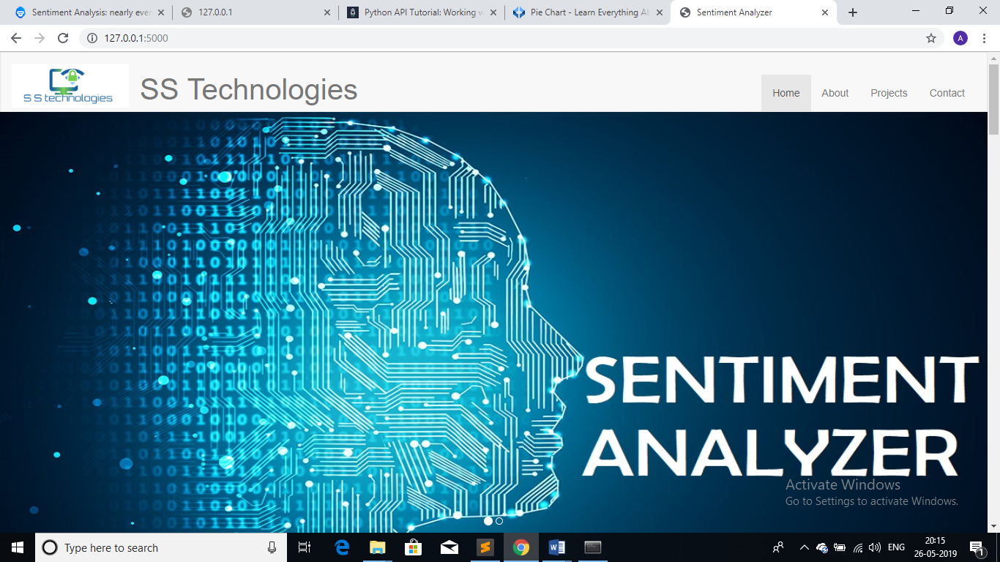
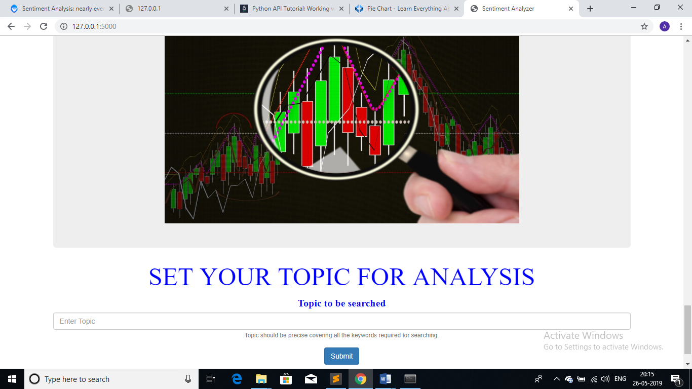
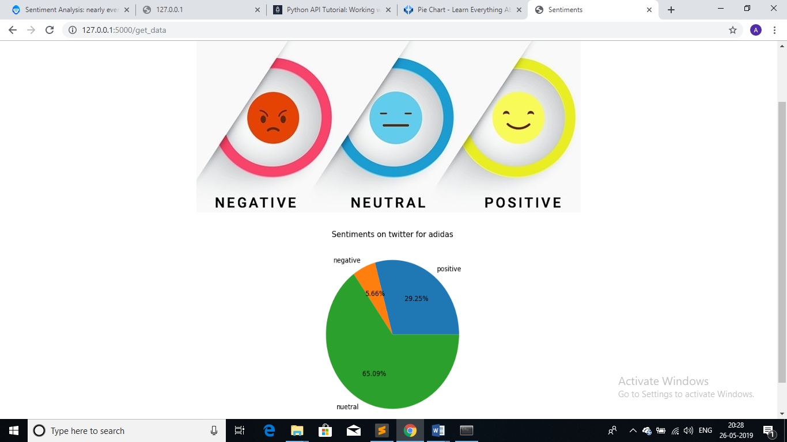

# Sentiment-Analyzer
It is a web app developed using python flask for taking a topic from user and returning sentiments on twitter about that topic.  
This flask app provides an inteface to the user as a web app and provides all the deatils about what the project is all about to the user through the webpage and asks user for a topic about which the sentiments of people in twitter are to be analysed.

The topic is then processed by the model for sentiment analysis using twitter which is explained in another respository named aentiment_analysis_using_twitter and a report is provided to the user through another webpage.

This respository is created to deploy the model created in the previous respository named as sentiment _analysis_using_twitter
